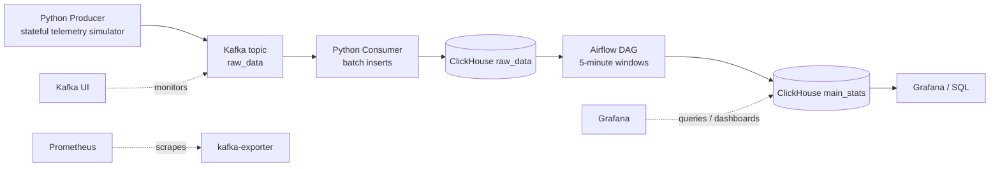

# CMAPSS-inspired Real-Time Turbofan Telemetry Pipeline

[Русская версия](README.ru.md)

## Project Overview

This is a local real-time data engineering pipeline that simulates turbofan engine telemetry, streams events through Kafka, stores raw telemetry in ClickHouse, and builds 5-minute aggregate statistics with Airflow. The telemetry generator is CMAPSS-inspired, but it does not replay the real NASA CMAPSS dataset. It is designed as a Junior Data Engineering portfolio project that demonstrates ingestion, batching, analytical storage, orchestration, and reliability tradeoffs in one Docker Compose stack.

## Why This Project Exists

Predictive maintenance and RUL/ML teams need a continuous stream of engine telemetry before they can build useful models and dashboards. They need raw event storage for audits and reprocessing, aggregate features for analysis, anomaly counts for monitoring, and reliable delivery behavior when downstream storage is temporarily unavailable. This project models that engineering scenario locally with simple, readable components.

## Architecture



Docker Compose also includes Kafka UI for broker/topic inspection, Prometheus with kafka-exporter for metrics, and Grafana for visualization work.

## Tech Stack

- Python for the producer and consumer.
- Apache Kafka for streaming raw telemetry events.
- ClickHouse for raw and aggregate analytical storage.
- Apache Airflow for scheduled 5-minute aggregations.
- Docker Compose for local infrastructure.
- PostgreSQL for Airflow metadata.
- Prometheus and Grafana for observability and visualization.

## Data Flow

1. Producer generates stateful turbofan telemetry events.
2. Events are sent to Kafka topic `raw_data` with `engine_id` as the Kafka message key.
3. Consumer reads Kafka messages in batches.
4. Consumer inserts raw events into ClickHouse table `raw_data`.
5. Consumer commits Kafka offsets only after a successful ClickHouse insert.
6. Airflow builds idempotent 5-minute aggregates into `main_stats`.
7. Data can be queried from ClickHouse and visualized later in Grafana.

## Engineering Highlights

- One-command local infrastructure with Docker Compose.
- Stateful telemetry simulator instead of fully random events.
- Kafka partitioning by `engine_id` key.
- ClickHouse raw and aggregate analytical storage.
- Batch inserts into ClickHouse.
- Manual Kafka offset commits after successful inserts.
- At-least-once delivery semantics.
- `event_id`-based duplicate detection.
- Idempotent Airflow aggregation windows.
- Observability stack included.

## Reliability Notes

The pipeline provides at-least-once delivery. Kafka offsets are committed only after ClickHouse accepts a batch, which prevents silent data loss when ClickHouse insert fails. If a failure happens after ClickHouse insert but before Kafka offset commit, Kafka may replay the same records and duplicates may appear in `raw_data`. Each raw event stores `event_id`, so duplicates are detectable. Airflow aggregates are idempotent because each DAG run deletes and recomputes one fixed 5-minute window before inserting fresh aggregate rows.

This is not exactly-once delivery and is not presented as production-ready infrastructure.

## Data Model

`raw_data` stores raw telemetry events:

- `event_id`, `engine_id`, `timestamp`, `cycle`
- sensor fields such as `altitude`, `mach_number`, `throttle`, `T2`, `T50`, `P2`, `P15`, `Nf`, `Nc`, `Ps30`, `phi`, `NRf`, `NRc`, `BPR`
- `anomaly`, `RUL`

`main_stats` stores fixed 5-minute aggregate windows:

- `window_start`, `window_end`, `engine_id`
- average sensor metrics
- `anomaly_count`
- `min_RUL`

## Quick Start

```bash
cp .env.example .env
docker compose up -d --build
docker compose ps
```

## Useful URLs

- Airflow: http://localhost:8080
- Kafka UI: http://localhost:8090
- ClickHouse HTTP: http://localhost:8123
- Grafana: http://localhost:3000
- Prometheus: http://localhost:9090

## Verification Commands

Producer logs:

```bash
docker compose logs -f producer
```

Consumer logs:

```bash
docker compose logs -f consumer
```

Raw row count:

```bash
docker compose exec -T clickhouse clickhouse-client \
  --user user --password passwd --database turbofan \
  --query "SELECT count() FROM raw_data"
```

`event_id` presence:

```bash
docker compose exec -T clickhouse clickhouse-client \
  --user user --password passwd --database turbofan \
  --query "SELECT count(), countIf(event_id != '') FROM raw_data"
```

Duplicate detection:

```bash
docker compose exec -T clickhouse clickhouse-client \
  --user user --password passwd --database turbofan \
  --query "SELECT event_id, count() FROM raw_data GROUP BY event_id HAVING count() > 1 LIMIT 10"
```

Aggregate windows:

```bash
docker compose exec -T clickhouse clickhouse-client \
  --user user --password passwd --database turbofan \
  --query "SELECT window_start, window_end, count() FROM main_stats GROUP BY window_start, window_end ORDER BY window_start DESC LIMIT 10"
```

Smoke test:

```bash
make smoke-test
```

## SQL Examples

Latest raw events:

```sql
SELECT event_id, engine_id, timestamp, cycle, RUL, anomaly
FROM raw_data
ORDER BY timestamp DESC
LIMIT 10;
```

Row count and non-empty `event_id` count:

```sql
SELECT count() AS rows, countIf(event_id != '') AS rows_with_event_id
FROM raw_data;
```

Duplicate `event_id` detection:

```sql
SELECT event_id, count() AS duplicates
FROM raw_data
GROUP BY event_id
HAVING duplicates > 1
ORDER BY duplicates DESC
LIMIT 10;
```

Minimum RUL per engine:

```sql
SELECT engine_id, min(RUL) AS min_rul
FROM raw_data
GROUP BY engine_id
ORDER BY engine_id;
```

Anomaly count per engine:

```sql
SELECT engine_id, countIf(anomaly = true) AS anomaly_count
FROM raw_data
GROUP BY engine_id
ORDER BY engine_id;
```

Latest 5-minute aggregate windows:

```sql
SELECT window_start, window_end, engine_id, avg_T2, avg_T50, anomaly_count, min_RUL
FROM main_stats
ORDER BY window_start DESC, engine_id
LIMIT 20;
```

## Reset Local State

If schema changes are not applied because old ClickHouse volumes exist, recreate local volumes:

```bash
docker compose down -v
docker compose up -d --build
```

## Makefile Commands

```bash
make up
make down
make restart
make ps
make logs
make logs-producer
make logs-consumer
make smoke-test
make clean
```

## Known Limitations

- Uses simulated CMAPSS-inspired data, not real CMAPSS replay.
- No Schema Registry yet.
- No dbt layer yet.
- No CI/tests yet.
- Grafana dashboards may need manual setup unless provisioning is added later.
- Raw layer detects duplicates but does not fully enforce exactly-once semantics.

## Future Improvements

- Real CMAPSS replay mode.
- Schema Registry.
- dbt models for marts and data tests.
- ReplacingMergeTree or materialized view deduplication.
- Grafana dashboard provisioning.
- CI pipeline.
- Dead-letter queue for malformed messages.
