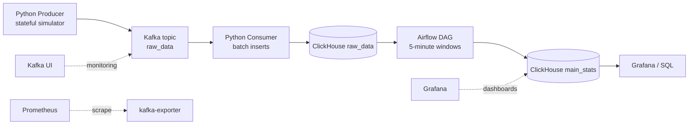

# CMAPSS-inspired Real-Time Turbofan Telemetry Pipeline

[English version](README.md)

## Обзор проекта

Это локальный real-time data engineering pipeline для симуляции телеметрии турбовентиляторного двигателя. Он отправляет события через Kafka, сохраняет сырые данные в ClickHouse и строит 5-минутные агрегаты через Airflow. Генератор вдохновлен CMAPSS, но не проигрывает настоящий NASA CMAPSS dataset. Проект сделан как понятное портфолио Junior Data Engineer.

## Зачем нужен проект

Командам predictive maintenance и RUL/ML нужен постоянный поток телеметрии, сырые события для аудита и переобработки, агрегированные признаки, счетчики аномалий и надежная доставка данных. Этот проект показывает такой сценарий локально и без лишней сложности.

## Архитектура



В Docker Compose также есть Kafka UI, Prometheus с kafka-exporter и Grafana.

## Tech Stack

- Python для producer и consumer.
- Apache Kafka для стриминга событий.
- ClickHouse для raw и aggregate аналитических таблиц.
- Apache Airflow для 5-минутных агрегаций.
- Docker Compose для локальной инфраструктуры.
- PostgreSQL для metadata database Airflow.
- Prometheus и Grafana для observability.

## Data Flow

1. Producer генерирует stateful telemetry events.
2. События отправляются в Kafka topic `raw_data` с ключом `engine_id`.
3. Consumer читает Kafka батчами.
4. Consumer вставляет raw events в ClickHouse.
5. Consumer коммитит Kafka offsets только после успешной вставки.
6. Airflow строит идемпотентные 5-минутные агрегаты.
7. Данные можно анализировать в ClickHouse и визуализировать в Grafana.

## Engineering Highlights

- Локальный запуск одной командой через Docker Compose.
- Stateful telemetry simulator вместо полностью случайных значений.
- Kafka partitioning по ключу `engine_id`.
- ClickHouse для raw и aggregate аналитики.
- Batch inserts в ClickHouse.
- Manual Kafka offset commits после успешной вставки.
- At-least-once delivery semantics.
- Duplicate detection через `event_id`.
- Идемпотентные Airflow aggregation windows.
- Observability stack включен.

## Reliability Notes

Pipeline использует at-least-once delivery. Kafka offsets коммитятся только после успешной вставки в ClickHouse, поэтому сбой ClickHouse не приводит к тихой потере данных. Если сбой произойдет после вставки, но до commit offset, Kafka может переотправить записи и в `raw_data` появятся дубликаты. `event_id` позволяет найти такие дубликаты. Airflow агрегаты идемпотентны: каждый запуск удаляет и пересчитывает фиксированное 5-минутное окно.

Это не exactly-once delivery и не production-ready система.

## Data Model

`raw_data` хранит сырые события:

- `event_id`, `engine_id`, `timestamp`, `cycle`
- sensor fields: `altitude`, `mach_number`, `throttle`, `T2`, `T50`, `P2`, `P15`, `Nf`, `Nc`, `Ps30`, `phi`, `NRf`, `NRc`, `BPR`
- `anomaly`, `RUL`

`main_stats` хранит 5-минутные окна:

- `window_start`, `window_end`, `engine_id`
- средние значения sensor metrics
- `anomaly_count`
- `min_RUL`

## Quick Start

```bash
cp .env.example .env
docker compose up -d --build
docker compose ps
```

## Useful URLs

- Airflow: http://localhost:8080
- Kafka UI: http://localhost:8090
- ClickHouse HTTP: http://localhost:8123
- Grafana: http://localhost:3000
- Prometheus: http://localhost:9090

## Verification Commands

Producer logs:

```bash
docker compose logs -f producer
```

Consumer logs:

```bash
docker compose logs -f consumer
```

Raw row count:

```bash
docker compose exec -T clickhouse clickhouse-client \
  --user user --password passwd --database turbofan \
  --query "SELECT count() FROM raw_data"
```

`event_id` presence:

```bash
docker compose exec -T clickhouse clickhouse-client \
  --user user --password passwd --database turbofan \
  --query "SELECT count(), countIf(event_id != '') FROM raw_data"
```

Duplicate detection:

```bash
docker compose exec -T clickhouse clickhouse-client \
  --user user --password passwd --database turbofan \
  --query "SELECT event_id, count() FROM raw_data GROUP BY event_id HAVING count() > 1 LIMIT 10"
```

Aggregate windows:

```bash
docker compose exec -T clickhouse clickhouse-client \
  --user user --password passwd --database turbofan \
  --query "SELECT window_start, window_end, count() FROM main_stats GROUP BY window_start, window_end ORDER BY window_start DESC LIMIT 10"
```

Smoke test:

```bash
make smoke-test
```

## SQL Examples

Latest raw events:

```sql
SELECT event_id, engine_id, timestamp, cycle, RUL, anomaly
FROM raw_data
ORDER BY timestamp DESC
LIMIT 10;
```

Row count and non-empty `event_id` count:

```sql
SELECT count() AS rows, countIf(event_id != '') AS rows_with_event_id
FROM raw_data;
```

Duplicate `event_id` detection:

```sql
SELECT event_id, count() AS duplicates
FROM raw_data
GROUP BY event_id
HAVING duplicates > 1
ORDER BY duplicates DESC
LIMIT 10;
```

Minimum RUL per engine:

```sql
SELECT engine_id, min(RUL) AS min_rul
FROM raw_data
GROUP BY engine_id
ORDER BY engine_id;
```

Anomaly count per engine:

```sql
SELECT engine_id, countIf(anomaly = true) AS anomaly_count
FROM raw_data
GROUP BY engine_id
ORDER BY engine_id;
```

Latest 5-minute aggregate windows:

```sql
SELECT window_start, window_end, engine_id, avg_T2, avg_T50, anomaly_count, min_RUL
FROM main_stats
ORDER BY window_start DESC, engine_id
LIMIT 20;
```

## Reset Local State

Если старый ClickHouse volume не применил новую схему:

```bash
docker compose down -v
docker compose up -d --build
```

## Makefile Commands

```bash
make up
make down
make restart
make ps
make logs
make logs-producer
make logs-consumer
make smoke-test
make clean
```

## Known Limitations

- Используются simulated CMAPSS-inspired данные, не real CMAPSS replay.
- Пока нет Schema Registry.
- Пока нет dbt layer.
- Пока нет CI/tests.
- Grafana dashboards могут требовать ручной настройки.
- Raw layer обнаруживает дубликаты, но не реализует exactly-once semantics.

## Future Improvements

- Real CMAPSS replay mode.
- Schema Registry.
- dbt models и data tests.
- Deduplication через ReplacingMergeTree или materialized view.
- Grafana dashboard provisioning.
- CI pipeline.
- Dead-letter queue для malformed messages.
